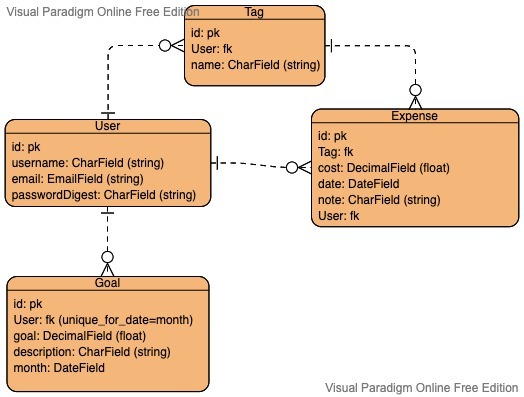
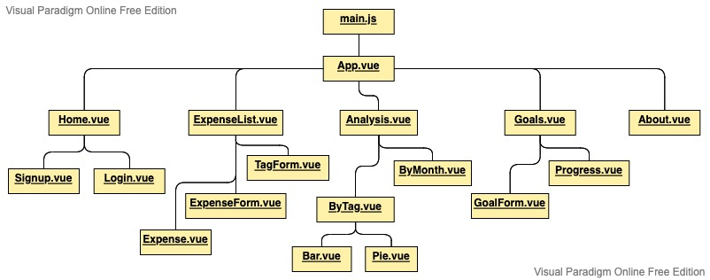

# cached-project

## **Date:** February 7, 2022

## **Author:** Narrwe Park

### Contact Links: [LinkedIn](https://www.linkedin.com/in/narrwe-park/) | [GitHub](https://github.com/narrwep27)

***

### **Description:**

Cached: a budgeting app to help keep track of your expenses and reach your savings goals. Log your purchases and get a detailed analysis of where and on what you spend most of your money on. Set savings goals and compare it to your spending.

**Note:** This project is still in development and being updated.

***

### **Getting Started:**

**Planning Links & Attachments:**

- Deployed Netlify Link: [cached](https://cached.netlify.app/)

- [Trello Board](https://trello.com/b/IhtXefM2)

- Entity Relationship Diagram:  

- Component Hierarchy Diagram:  

***

### **Technologies Used:**

- PostgreSQL
- Django
  - Django Rest Framework (DRF)
  - DRF SimpleJWT
- Axios
- HTML5
- CSS3
- Javascript ES6
- Vue.js
  - Vuex
- Heroku
- Netlify

### **Screenshots:**

### **Credits:**

- [Visual Paradigm Online](https://www.visual-paradigm.com/)
- [Trello](https://trello.com/)
- [Starline/Freepik Background Image](https://www.freepik.com/free-vector/white-background-with-triangle-patterns_4403214.htm#query=background%20pattern&position=1&from_view=keyword)
- [Vue Material Design Icons](https://www.npmjs.com/package/vue-material-design-icons)
- [vue3-snackbar Toast Notifications](https://github.com/craigrileyuk/vue3-snackbar)
