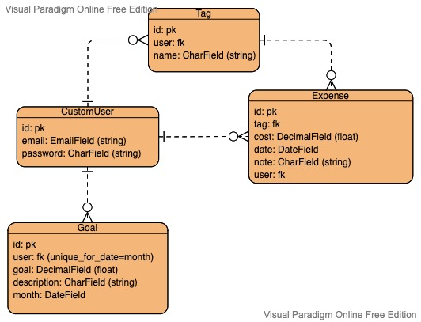

# cached-project

## **Date:** February 7, 2022

## **Author:** Narrwe Park

### Contact Links: [LinkedIn](https://www.linkedin.com/in/narrwe-park/) | [GitHub](https://github.com/narrwep27)

***

### **Description:**

Cached: a budgeting app to help keep track of your expenses and reach your savings goals. Log your purchases and get a detailed analysis of where and on what you spend most of your money on. Set savings goals and compare it to your spending.

**Note:** This project is still in development and being updated.

***

### **Getting Started:**

**Planning Links & Attachments:**

- [Trello Board](https://trello.com/b/IhtXefM2)
- Entity Relationship Diagram:  

- Component Hierarchy Diagram:  

- Deployed Heroku Link:

***

### **Technologies Used:**

- PostgreSQL
- Django
- Axios
- HTML5
- CSS3
- Javascript ES6
- Vue.js
- Heroku
- **Vue Libraries

### **Screenshots:**

### **Credits:**

- [Visual Paradigm Online](https://www.visual-paradigm.com/)
- [Trello](https://trello.com/)
- [Starline/Freepik Background Image](https://www.freepik.com/free-vector/white-background-with-triangle-patterns_4403214.htm#query=background%20pattern&position=1&from_view=keyword)
